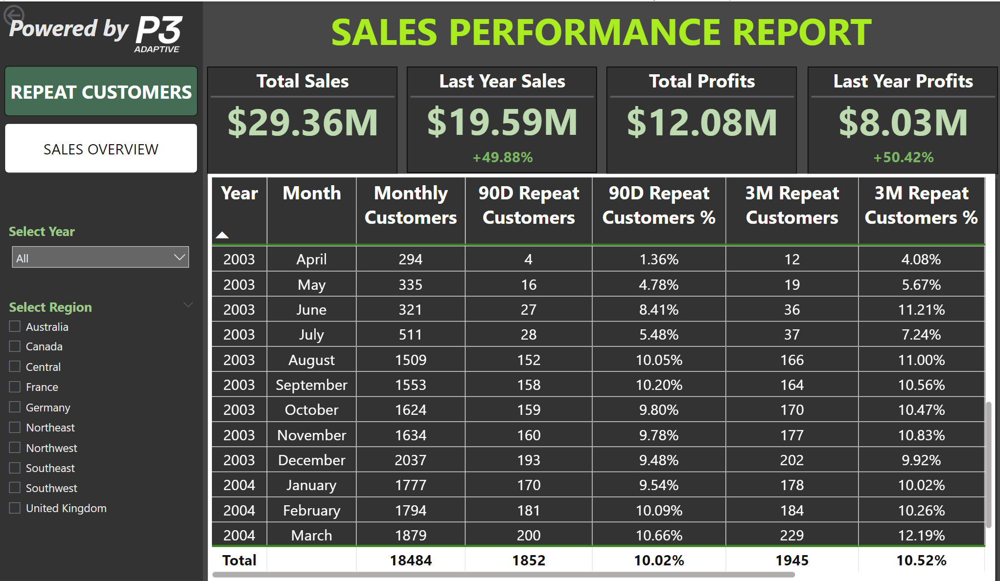
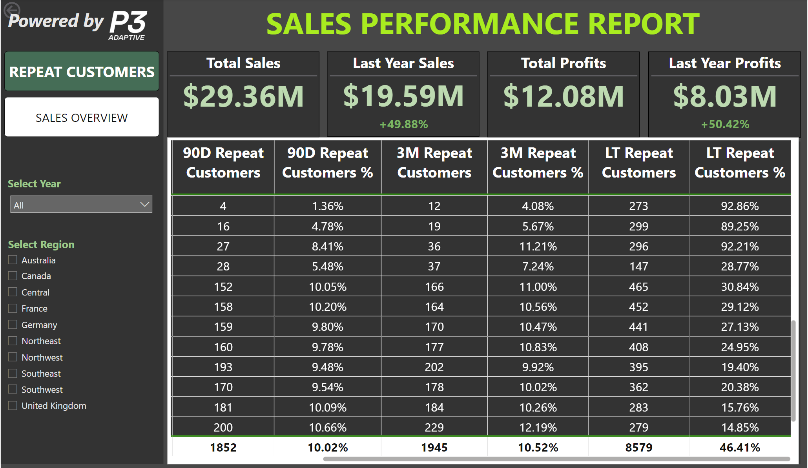

**MISSION:** Use the data contained within the sent Excel file to create
a Power BI data model using industry best practices to solve our
simulated consulting project business challenge and to create a demo
report.

-   Recreate the legacy report from the Excel file screenshot.

-   Consider that the client will add additional data and therefore
    needs time-intelligence calculations.

-   Design an additional 1--2-page report demo highlighting both data
    analysis and report design.

1.  **LEGACY REPORT**


2.  **EXPLORATORY DATA ANALYSIS**

We found several issues in the report upon exploring the data:

-   First, the primary metric (Percent Customers Returned within 90 Days
    of **FIRST** Purchase) did not actually have any positive hits for
    the first two years. For 2001 and 2002, none of the customers
    purchased again the same year, let alone the same quarter.

    -   

    -   

> **Corrective Action:** After sharing and discussing this finding with
> the client, it was decided to update the metrics to a more generic
> calculation of monthly customers and the count and percentage who
> returned within 90 days (inclusive) and within 3 months (exclusive) of
> any given monthly purchase. So instead of counting repeat customers
> from their **First month**, we count repeat customers for **Each
> month.**
```
90D_Repeat_Customer_Cnt = 

/* Capture Distinct CustomerKeys per row-context (month of year) */
VAR CustomerList = VALUES( Sales[CustomerKey] )                             

/* Add up items-per-invoice and invoice per customer so all "lines" are weighted to add up to 1 */
VAR CustomerMonthlyOrderCount =                                             
    CALCULATE(  
        COUNTROWS(Sales)                                                    // Count number of sales rows
        , ALLEXCEPT(Sales, Sales[CustomerYearMonth])                        // associated with each unique combination of CustomerKey & OrderYearMonth
    )  

/* Determine if this purchase was followed up by another within 90 days (1 means yes) */
VAR RepeatCustomerFlag =                                                    
    COUNTROWS(                                                              // Count number of rows
        FILTER(                                                             // where we filter
            CustomerList,                                                   // Distinct CustomerKeys
            CALCULATE(                                                      // and calculate
                COUNTROWS(Sales),                                           // the number of sales rows
                FILTER(                                                     // where we filter
                    ALLSELECTED('Sales'),                                   // AllSelected rows in Sales table
                    'Sales'[OrderDate] > MIN('Sales'[OrderDate])            // such that current-row-OrderDate is > minimum-date (exclusive)
                    && 'Sales'[OrderDate] <= MIN('Sales'[OrderDate]) + 90   // and current-row-OrderDate is >= minimum-date-right-shifted-90-days (inclusive)
                )
            )
        )
    )

/* Calculate contribution of each partial-invoice by dividing RepeatFlag (0 or 1) by InvoiceCount; 2 becomes 0.5, 4 becomes 0.25, etc... */
VAR RepeatCustomerCount = DIVIDE(RepeatCustomerFlag, CustomerMonthlyOrderCount, 0)       

RETURN
    RepeatCustomerCount
```
> For the 3 month calculation we use this modified measure:
```
3M_Repeat_Customer_Cnt = 

/* Capture Distinct CustomerKeys per row-context (month of year) */
VAR CustomerList = VALUES( Sales[CustomerKey] )                             

/* Add up items-per-invoice and invoice per customer so all "lines" are weighted to add up to 1 */
VAR CustomerMonthlyOrderCount =                                             
    CALCULATE(  
        COUNTROWS(Sales)                                                        // Count number of sales rows
        , ALLEXCEPT(Sales, Sales[CustomerYearMonth])                            // associated with each unique combination of CustomerKey & OrderYearMonth
    )  

/* Determine if this purchase was followed up by another within 3 months (1 means yes) */
VAR RepeatCustomerFlag =                                                    
    COUNTROWS(                                                                  // Count number of rows
        FILTER(                                                                 // where we filter
            CustomerList,                                                       // Distinct CustomerKeys
            CALCULATE(                                                          // and calculate
                COUNTROWS(Sales),                                               // the number of sales rows
                FILTER(                                                         // where we filter
                    ALLSELECTED('Sales'),                                       // AllSelected rows in Sales table
                    'Sales'[OrderDate] > EOMONTH(MIN(Sales[OrderDate]), 0 )     // such that current-row-OrderDate is > minimum-date-end-of-month (exclusive)
                    && 'Sales'[OrderDate] <= EOMONTH(MIN(Sales[OrderDate]), 3 ) // and is <= minimum-date-end-of-month-right-shifted-3-months (inclusive)
                )
            ) > 0                                                               // where # of sales is greater than zero
        )
    )

/* Calculate contribution of each partial-invoice by dividing RepeatFlag (0 or 1) by InvoiceCount; 2 becomes 0.5, 4 becomes 0.25, etc... */
VAR RepeatCustomerCount = DIVIDE(RepeatCustomerFlag, CustomerMonthlyOrderCount, 0)       

RETURN
    RepeatCustomerCount
```
>
> **Because of this, the updated report shows no repeat customers in
> 2001 and 2002:**


-   Secondly, the updated calculations for 90D and 3M repeat customers
    show that quarterly repeat customers did not occur until April 2003:



-   Finally, to make a comparison with the quarterly metrics, we added a
    Lifetime (LT) Repeat Customer metric to see if a customer in any
    given month or year purchased again (without and upper time limit):



3.  **SALES PERFORMANCE**


-   Total vs Last Year Sales with %-Change KPI card.

-   Total vs Last Year Profits with %-Change KPI card.

-   Sales and Profit line/bar chart with time-intelligent drill-down.

-   Sales by Region to inform marketing efforts appropriate to each
    region.

-   Top 10 Products to identify high revenue items for inventory
    balancing.

-   Top 10 Customers to identify high-value outreach targets.

-   Year and Region slicers to investigate historical and categorical
    data.


**P3 Adaptive Consulting Team**

**Name**: Ahmed Rashed **Title**: Principal BI Consultant **Date**:
April 15, 2024
